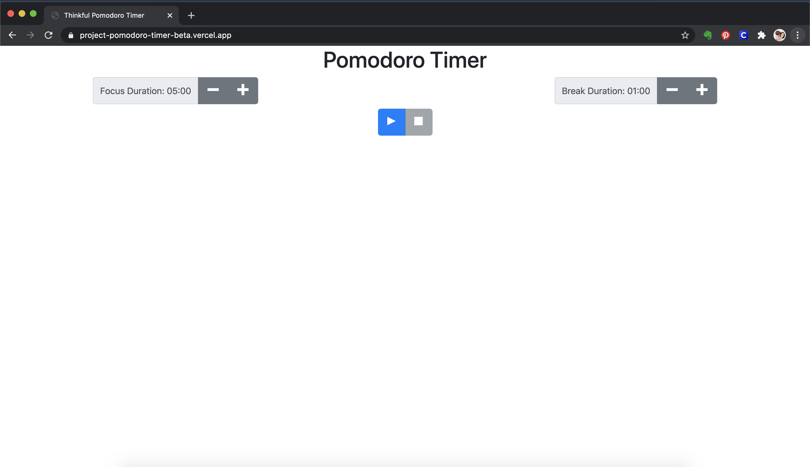

# Pomodoro Timer App

The application allows users to set a focus timer and a break timer using the Pomodoro method for productivity. The focus timer is set in 5 minute increments from 5 - 60 minutes. The break timer is set in 1 minute increments from 1 - 5 minutes. A countdown clock and progress bar run when timer is active.

## Built With

* React.js
* Bootstrap
* JSX
* Javascript

## Deployment

* [Pomodoro Timer](https://project-pomodoro-timer-beta.vercel.app/)

